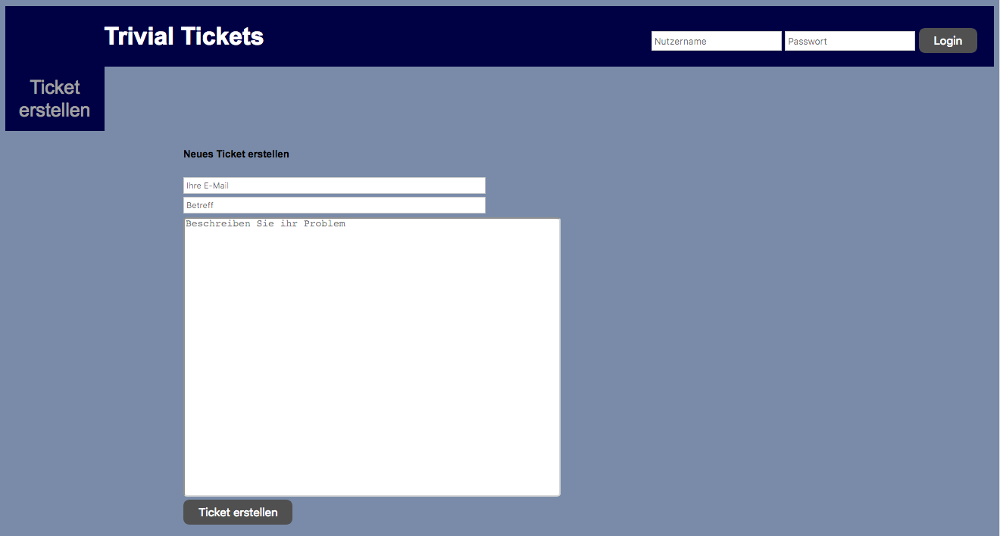

# Trivial Tickets Ticketsystem

[][travis]
[][codecov]
[][godoc]
[][license-gpl3]
[][github-releases]
[][sourcegraph]
[![Code Style Revive](https://img.shields.io/badge/code%20style-revive-blue.svg?style=flat&logo=data:image/svg+xml;charset=utf8;base64,PHN2ZyB2ZXJzaW9uPSIxLjEiIGlkPSJDYXBhXzEiIHhtbG5zPSJodHRwOi8vd3d3LnczLm9yZy8yMDAwL3N2ZyIgeG1sbnM6eGxpbms9Imh0dHA6Ly93d3cudzMub3JnLzE5OTkveGxpbmsiIHg9IjBweCIgeT0iMHB4IiB3aWR0aD0iNTEyIiBoZWlnaHQ9IjUxMiIgdmlld0JveD0iMCAwIDUyMi40NjggNTIyLjQ2OSIgc3R5bGU9ImVuYWJsZS1iYWNrZ3JvdW5kOm5ldyAwIDAgNTIyLjQ2OCA1MjIuNDY5OyIgeG1sOnNwYWNlPSJwcmVzZXJ2ZSIgY2xhc3M9IiI+PGc+PGc+Cgk8Zz4KCQk8cGF0aCBkPSJNMzI1Ljc2Miw3MC41MTNsLTE3LjcwNi00Ljg1NGMtMi4yNzktMC43Ni00LjUyNC0wLjUyMS02LjcwNywwLjcxNWMtMi4xOSwxLjIzNy0zLjY2OSwzLjA5NC00LjQyOSw1LjU2OEwxOTAuNDI2LDQ0MC41MyAgICBjLTAuNzYsMi40NzUtMC41MjIsNC44MDksMC43MTUsNi45OTVjMS4yMzcsMi4xOSwzLjA5LDMuNjY1LDUuNTY4LDQuNDI1bDE3LjcwMSw0Ljg1NmMyLjI4NCwwLjc2Niw0LjUyMSwwLjUyNiw2LjcxLTAuNzEyICAgIGMyLjE5LTEuMjQzLDMuNjY2LTMuMDk0LDQuNDI1LTUuNTY0TDMzMi4wNDIsODEuOTM2YzAuNzU5LTIuNDc0LDAuNTIzLTQuODA4LTAuNzE2LTYuOTk5ICAgIEMzMzAuMDg4LDcyLjc0NywzMjguMjM3LDcxLjI3MiwzMjUuNzYyLDcwLjUxM3oiIGRhdGEtb3JpZ2luYWw9IiMwMDAwMDAiIGNsYXNzPSJhY3RpdmUtcGF0aCIgc3R5bGU9ImZpbGw6I0ZGRkVGRSIgZGF0YS1vbGRfY29sb3I9IiNGQkY1RjUiPjwvcGF0aD4KCQk8cGF0aCBkPSJNMTY2LjE2NywxNDIuNDY1YzAtMi40NzQtMC45NTMtNC42NjUtMi44NTYtNi41NjdsLTE0LjI3Ny0xNC4yNzZjLTEuOTAzLTEuOTAzLTQuMDkzLTIuODU3LTYuNTY3LTIuODU3ICAgIHMtNC42NjUsMC45NTUtNi41NjcsMi44NTdMMi44NTYsMjU0LjY2NkMwLjk1LDI1Ni41NjksMCwyNTguNzU5LDAsMjYxLjIzM2MwLDIuNDc0LDAuOTUzLDQuNjY0LDIuODU2LDYuNTY2bDEzMy4wNDMsMTMzLjA0NCAgICBjMS45MDIsMS45MDYsNC4wODksMi44NTQsNi41NjcsMi44NTRzNC42NjUtMC45NTEsNi41NjctMi44NTRsMTQuMjc3LTE0LjI2OGMxLjkwMy0xLjkwMiwyLjg1Ni00LjA5MywyLjg1Ni02LjU3ICAgIGMwLTIuNDcxLTAuOTUzLTQuNjYxLTIuODU2LTYuNTYzTDUxLjEwNywyNjEuMjMzbDExMi4yMDQtMTEyLjIwMUMxNjUuMjE3LDE0Ny4xMywxNjYuMTY3LDE0NC45MzksMTY2LjE2NywxNDIuNDY1eiIgZGF0YS1vcmlnaW5hbD0iIzAwMDAwMCIgY2xhc3M9ImFjdGl2ZS1wYXRoIiBzdHlsZT0iZmlsbDojRkZGRUZFIiBkYXRhLW9sZF9jb2xvcj0iI0ZCRjVGNSI+PC9wYXRoPgoJCTxwYXRoIGQ9Ik01MTkuNjE0LDI1NC42NjNMMzg2LjU2NywxMjEuNjE5Yy0xLjkwMi0xLjkwMi00LjA5My0yLjg1Ny02LjU2My0yLjg1N2MtMi40NzgsMC00LjY2MSwwLjk1NS02LjU3LDIuODU3bC0xNC4yNzEsMTQuMjc1ICAgIGMtMS45MDIsMS45MDMtMi44NTEsNC4wOS0yLjg1MSw2LjU2N3MwLjk0OCw0LjY2NSwyLjg1MSw2LjU2N2wxMTIuMjA2LDExMi4yMDRMMzU5LjE2MywzNzMuNDQyICAgIGMtMS45MDIsMS45MDItMi44NTEsNC4wOTMtMi44NTEsNi41NjNjMCwyLjQ3OCwwLjk0OCw0LjY2OCwyLjg1MSw2LjU3bDE0LjI3MSwxNC4yNjhjMS45MDksMS45MDYsNC4wOTMsMi44NTQsNi41NywyLjg1NCAgICBjMi40NzEsMCw0LjY2MS0wLjk1MSw2LjU2My0yLjg1NEw1MTkuNjE0LDI2Ny44YzEuOTAzLTEuOTAyLDIuODU0LTQuMDk2LDIuODU0LTYuNTcgICAgQzUyMi40NjgsMjU4Ljc1NSw1MjEuNTE3LDI1Ni41NjUsNTE5LjYxNCwyNTQuNjYzeiIgZGF0YS1vcmlnaW5hbD0iIzAwMDAwMCIgY2xhc3M9ImFjdGl2ZS1wYXRoIiBzdHlsZT0iZmlsbDojRkZGRUZFIiBkYXRhLW9sZF9jb2xvcj0iI0ZCRjVGNSI+PC9wYXRoPgoJPC9nPgo8L2c+PC9nPiA8L3N2Zz4=
  "Code Style checked by Revive")][revive]
[][golangci]

[][github-contributors]
[][github-stargazers]
[][github-fork]

## Table of Contents

<!-- START doctoc generated TOC please keep comment here to allow auto update -->
<!-- DON'T EDIT THIS SECTION, INSTEAD RE-RUN doctoc TO UPDATE -->

* [Project Description](#project-description)
  * [Available Operations](#available-operations)
  * [The E-Mail Recipience API](#the-e-mail-recipience-api)
  * [The E-Mail Dispatch API](#the-e-mail-dispatch-api)
  * [The Command-line Tool](#the-command-line-tool)
  * [Further Information](#further-information)
* [Homepage Preview](#homepage-preview)
* [Current Project Coverage](#current-project-coverage)
* [Installation](#installation)
* [Build and Execution](#build-and-execution)
  * [Executing the server](#executing-the-server)
  * [Executing the tests](#executing-the-tests)
  * [Generating a coverage report](#generating-a-coverage-report)
  * [Cleaning untracked tickets and mails](#cleaning-untracked-tickets-and-mails)
* [Configuration](#configuration)
  * [Server options](#server-options)
    * [`-port <PORT>`](#-port-port)
    * [`-tickets <DIR>`](#-tickets-dir)
    * [`-users <FILE>`](#-users-file)
    * [`-mails <DIR>`](#-mails-dir)
    * [`-cert <FILE>`](#-cert-file)
    * [`-key <FILE>`](#-key-file)
    * [`-web <DIR>`](#-web-dir)
  * [Logging options](#logging-options)
    * [`-log-level <LEVEL>`](#-log-level-level)
    * [`-verbose`](#-verbose)
    * [`-full-paths`](#-full-paths)
  * [Help options](#help-options)
    * [`-h`, `-help`](#-h--help)
* [The Command-line Tool (mailing service)](#the-command-line-tool-mailing-service)
  * [Build and Execution](#build-and-execution-1)
  * [Usage](#usage)
  * [Client options](#client-options)
    * [`-host <HOST>`](#-host-host)
    * [`-port <PORT>`](#-port-port-1)
    * [`-cert <FILE>`](#-cert-file-1)
  * [Fetch options](#fetch-options)
    * [`-f` (fetch)](#-f-fetch)
  * [Submit options](#submit-options)
    * [`-s` (submit)](#-s-submit)
    * [`-email <EMAIL>`](#-email-email)
    * [`-subject <SUBJECT>`](#-subject-subject)
    * [`-message <MSG>`](#-message-msg)
    * [`-tID <ID>`](#-tid-id)
  * [Help options](#help-options-1)
    * [`-h`, `-help`](#-h--help-1)
* [Requirements](#requirements)
  * [1. Non-functional](#1-non-functional)
  * [2. General](#2-general)
  * [3. Security](#3-security)
  * [4. Ticket](#4-ticket)
  * [5. Ticket creation on the website](#5-ticket-creation-on-the-website)
  * [6. E-Mail Recipience over a REST-API](#6-e-mail-recipience-over-a-rest-api)
  * [7. E-Mail Dispatch over a REST-API](#7-e-mail-dispatch-over-a-rest-api)
  * [8. Editing of tickets](#8-editing-of-tickets)
  * [9. Storage](#9-storage)
  * [10. Configuration](#10-configuration)
  * [11. Execution](#11-execution)
  * [Optional Requirements](#optional-requirements)
* [Submission](#submission)
  * [Submission Scope](#submission-scope)
  * [Evaluation Criteria](#evaluation-criteria)
  * [Prerequisites](#prerequisites)
* [User Manual](#user-manual)
* [Mail API](#mail-api)
* [Frequently Asked Questions](#frequently-asked-questions)
* [License](#license)
* [Wiki Links](#wiki-links)
* [External Links](#external-links)

<!-- END doctoc generated TOC please keep comment here to allow auto update -->

## Project Description

Trivial Tickets is a basic implementation of a support ticket system in Go.
Customers of a company can easily create tickets with the form on the home page
(see the screenshot below) and display the created tickets over a static
permalink. The author of a ticket is informed about every action the ticket
experiences by an email written to his email address.

### Available Operations

Registered users are the assignees of the system and work on the customer's
tickets. They can log in and off the system and assign a ticket to themselves or
to other users. An assignee can only edit information on those ticket that he is
assigned to. He can release his tickets, add comments to it or change the status
of the ticket. It is also possible to merge two tickets to one, but only if the
customer and the assignee of both tickets match. Additionally, an assignee may
indicate that he is on holiday. In this case, tickets cannot be assigned to him.

### The E-Mail Recipience API

The ticket system offers an E-Mail Recipience and Dispatch API for a mailing
service to interact with the system. A request with the properties `from` (the
sender's e-mail address, i.e the customer), `subject` (the ticket's subject) and
`message` (the actual message) set can be delivered to the server in order to
create new tickets by mail. If the subject contains the ticket id of an already
existing ticket in a special markup the e-mail creates a new answer to this
ticket instead of a new ticket.

### The E-Mail Dispatch API

Likewise, the mailing service can fetch e-mails created by the server on special
events (such as creation of a new ticket or update of a ticket). The server then
sends back all e-mails remaining to be sent to the customer. After the service
has sent the received e-mails it can confirm the successful sending of the
concerned e-mails by sending a verification request to the server. This is done
for each e-mail by applying the id of the certain mail to the request. If the
server can ensure that the respective e-mail exists the mail can be safely
deleted and the verification result is returned to the service. More information
on the Mail API and its functionality can be found on :book:
[Mail API Reference][wiki-mail-api-reference].

### The Command-line Tool

The repository contains a command-line tool which serves as simple example for
an external mailing service. Although it cannot send or receive genuine e-mails
it can communicate with the mail API of the server. The user can write really
simple e-mails with e-mail address, subject and message to be sent to the
server. Alternatively, he may retrieve all server-side created e-mails that are
print to the console then. All fetched e-mails are verified against the server
who can delete the mails then safely.

### Further Information

Consult the :closed_book: [User Manual][user-manual-de] for more information
(currently only available in German) or alternatively checkout our :book:
[Wiki Pages][wiki-home].

## Homepage Preview



_Preview of the Trivial Tickets Homepage_

## Current Project Coverage

[][codecov]

_Coverages for the different packages and files as evaluated by
[codecov.io][codecov]_

The coverage sunburst is a graph of the project in a multi-level pie chart.
The color represents the coverage of the project, folder, and files. The
innermost circle is the entire project, the next slices are folders leading
to the outermost slices which are files.

## Installation

To install the Trivial Tickets ticket system, first ensure you have a working Go
environment installed. Go version 1.7 and above are supported. Set the `GOPATH`
environment variable to your desired location and then execute

```bash
go get -u -v github.com/mortenterhart/trivial-tickets
```

This command requires [git][git] to be installed. It downloads and installs
all project dependencies to your setup Go workspace. For more information
on how to set the `GOPATH` environment variable accordingly visit [Setting
GOPATH][go-setting-gopath] from the Go Wiki.

The ticket system is now installed under
`$GOPATH/src/github.com/mortenterhart/trivial-tickets`.

:warning: Please do not use the `go install` command as it puts the binary to
`$GOPATH/bin` and the default file and directory paths get incorrect.

## Build and Execution

### Executing the server

To build the ticket system, you can run the following command from the
repository's root folder:

```bash
go build ./cmd/ticketsystem
```

Make sure to build the executable from the mentioned directory so that the
default paths still apply correctly. Your binary should be located at
`ticketsystem` or `ticketsystem.exe` depending on your operating system
then which can be executed with

```bash
./ticketsystem [options]
```

A more convenient way to start the server is to use the start scripts in the
root directory. Run

```bash
./startServer.sh [options]
```

or `startServer.bat` on Windows systems. The same applies to the command-line
tool (`./startCLI.sh` and `startCLI.bat`). See the :paperclip:
[Configuration](#configuration) section for a list of valid options.

### Executing the tests

The unit tests for the different components of the server can be executed with
the following command from the root directory:

```bash
go test -v ./...
```

This executes all tests in all sub-packages. For details about the coverage use
the option `-cover`.

### Generating a coverage report

To generate a coverage report about one or more packages, use the provided
script `coverage_report.sh`. Run

```bash
./coverage_report.sh
```

to generate a coverage report of all sub-packages with default options. The
report will be rendered as HTML and opens in your default web browser.

Try `./coverage_report.sh --help` for a complete list of options or
alternatively consult this :book: [Wiki page][wiki-coverage-report].

### Cleaning untracked tickets and mails

The server will create new tickets and mails on certain events in the configured
directories (by default `files/tickets` and `files/mails`). There are three
tickets predefined in this repository. All other tickets and mails are ignored
by Git.

To cleanup all untracked tickets and mails, i.e. every other file except the
predefined tickets, use the following script:

```bash
./cleanupUntrackedTickets.sh
```

The script will prompt for confirmation before removing any files unless the
option `--force` was given. If the confirmation was successful it will remove
all ticket and mail files not tracked by Git. This is done by the `git clean`
command.

Try `./cleanupUntrackedTickets.sh --help` for a list of available options or
alternatively checkout this :book: [Wiki Page][wiki-cleaning-tickets].

## Configuration

The ticket system main executable
[`ticketsystem.go`](cmd/ticketsystem/ticketsystem.go) offers the following
configuration flags. They can be used to alter the default configuration of the
server and the logger. No option is required since every option has a meaningful
default value.

The usage of the executable looks like following:

```bash
./ticketsystem [options]
```

### Server options

The following server options can change important connection settings such as
the port and file or directory paths to important resources.

#### `-port <PORT>`

Specify the port on which the web server will be launched. On startup a message
with the server's URL will be shown. The `PORT` is a 16 bit unsigned integer (0
< `PORT` &le; 65535) and should not be used by another process. If the specified
port is blocked the server throws an error at startup.

**Default**: `8443`

#### `-tickets <DIR>`

Configure the directory where the tickets will be stored. The `DIR` argument can
be an existing directory with active write privileges, otherwise it is created
on startup automatically. Note that the path has to be relative to the current
working directory. The `*.json` files in this directory have to contain valid
JSON content.

**Default**: `./files/tickets`

#### `-users <FILE>`

Change the default path to the users file. The `FILE` argument has to be an
existing JSON file with user definitions. Note that the path has to be relative
to the current working directory.

**Default**: `./files/users/users.json`

#### `-mails <DIR>`

Specify the directory where new mails created by the server will be saved. The
`DIR` argument can be an existing directory with active write privileges,
otherwise it is created on startup automatically. Note that the path has to be
relative to the current working directory. If `DIR` already contains `*.json`
files they have to contain valid JSON format.

**Default**: `./files/mails`

#### `-cert <FILE>`

Set the path to the SSL server certificate. The `FILE` argument has to be an
existing file with a valid SSL certificate. Note that the path has to be
relative to the current working directory.

**Default**: `./ssl/server.cert`

#### `-key <FILE>`

Set the path to the SSL server key. The `FILE` argument has to be an existing
file with a valid SSL public key. Note that the path has to be relative to the
current working directory.

**Default**: `./ssl/server.key`

#### `-web <DIR>`

Change the root directory of the web server. The `DIR` argument has to be an
existing directory and should match the templates path and static paths pointing
to the server resources (such as `/static/js/ticketsystem.js`).

**Default**: `./www`

### Logging options

The logging options alter the way messages are logged to the console.

#### `-log-level <LEVEL>`

Specify the level of logging. The given `LEVEL` can be one of the following:

* `info`: display all log messages (recommended)
* `warning`: display only warnings, errors and fatal errors
* `error`: display only errors and fatal errors
* `fatal`: display only fatal errors (not recommended)

Fatal errors are always logged and cause the server to shutdown directly.
Therefore it is not advised to set the log level to `fatal`.

**Default**: `info`

#### `-verbose`

Enable verbose logging output (includes information about package path and
function name, filenames and line numbers on every log message). For better
readability, the package and file paths are trimmed to the last component, so
leading directories will be stripped.

**Default**: `false`

#### `-full-paths`

Disable the abbreviation of package and file paths. Paths are written as is to
the log. This option is compatible to `-verbose`.

Warning: This will extend log messages a lot making it harder to read. Depending
on your screen size the messages will probably not fit on the screen.

**Default**: `false`

### Help options

The help options provide information about the usage of the ticket system and
its flags.

#### `-h`, `-help`

Print a help text with information about the flags and exit.

## The Command-line Tool (mailing service)

The command-line tool can be used to interact with the server's E-Mail
Recipience and Dispatch APIs. A user can create an e-mail which is sent to the
server and has to supply a valid e-mail address, a subject and the message. The
created mail is then delivered to the E-Mail-Receive API of the server where a
new ticket will be created out of this mail. Optionally, the user may supply an
existing ticket id to create a new answer instead of a new ticket.

Another option is to retrieve all created e-mails on server-side. The mails are
fetched from the server and output to the console. For each fetched mail the
command-line tool confirms the successful sending of the e-mail by calling
another API to verify the sending. The tool cannot send genuine e-mails of
course, but the sending of the mails is simulated. After each mail is verified
to be sent correctly the server deletes these mails from cache and from file
system.

### Build and Execution

The command-line tool can be built in the same way than the server by executing

```bash
go build ./cmd/command_line_tool
```

from the project's root directory. A better option is to use the attached start
scripts for UNIX and Windows systems. To use these, run

```bash
./startCLI.sh [options]
```

or `startCLI.bat` on Windows, respectively. Options can be appended to the call
and they are delegated to the command-line tool. See the following section for a
list of available options.

### Usage

The command-line tool can be run in the following way:

```bash
./command_line_tool [options]
```

If the command-line tool is started without options, the user is guided by an
interactive menu. Otherwise he has to supply the required options by himself and
there is no prompting for user input.

In the following the available options are listed.

### Client options

The following options can be used to configure the client's connection settings.

#### `-host <HOST>`

Use another host name or IP address for the server the client is connecting to.

**Default**: `localhost`

#### `-port <PORT>`

Specify the port the server listens to. The `PORT` argument has to be a 16 bit
unsigned integer (0 < `PORT` &le; 65536) and has to match the server port.

**Default**: `8443`

#### `-cert <FILE>`

Use another SSL certificate for the connection to the server. The `FILE`
argument has to be an existing file with a valid SSL certificate. Note that the
path has to be relative to the current working directory.

**Default**: `./ssl/server.cert`

### Fetch options

The fetch options configure the way e-mails are retrieved from the server.

#### `-f` (fetch)

Fetch the server-side created e-mails from the server. If this option is set,
there will be no interactive prompt, but only the messages are retrieved.

**Default**: `false`

### Submit options

The submit options are used to specify e-mail properties for a direct submission
of an e-mail without user inputs.

#### `-s` (submit)

Use this flag to directly submit a message to the server without prompting. The
mail properties are set by the `-email`, `-subject` and `-message` flags and are
required. If the `-tID` option is specified with a valid ticket id a new answer
will be created instead of a new ticket.

**Default**: `false`

#### `-email <EMAIL>`

Specify the sender's e-mail address used for the creation of a new e-mail. The
`EMAIL` argument has to be a valid e-mail address. Only applicable in
conjunction to the `-s` flag.

**Default**: empty

#### `-subject <SUBJECT>`

Specify the subject of the new created ticket or answer. The `SUBJECT` argument
should not be empty. Only applicable in conjunction to the `-s` flag.

**Default**: empty

#### `-message <MSG>`

Specify the message for the new created ticket or answer. The `MSG` argument
should not be empty. Only applicable in conjunction to the `-s` flag.

**Default**: empty

#### `-tID <ID>`

Specify the ticket id of an existing ticket to append the message as a new
answer to this ticket. This flag is optional and if it is not set or if the
ticket id is invalid, a new ticket will be created. Only applicable in
conjunction to the `-s` flag.

**Default**: empty

### Help options

The help options provide information about the command-line tool and its
provided flags.

#### `-h`, `-help`

Print a help text with information about the flags and exit.

## Requirements

### 1. Non-functional

1. Third-party packages are not allowed. The only exception are packages which
   simplify the tests and error handling. Recommended are
   [`github.com/stretchr/testify/assert`](https://github.com/stretchr/testify/assert)
   and [`github.com/pkg/errors`](https://github.com/pkg/errors).
2. All source files and the PDF file must contain the matriculation numbers of
   all team members.

### 2. General

1. The application has to administrate only one mandator or project,
   respectively. More ticket systems on the same server are not required.
2. The application should be executable on Windows and Linux.
3. All major browsers such as Internet Explorer 11, Firefox, Chrome and Edge
   should be supported in its current version. This requirement is met the
   easiest if complex JavaScript/CSS is avoided.

### 3. Security

1. The website should be only accessible through HTTPS.
2. The access for the assignees should be protected by a username and a
   password.
3. The passwords may not be saved as plain text.
4. Password salting should be used.
5. All credentials should be saved in one common file.

### 4. Ticket

1. A ticket contains
   * an unique identifier
   * a subject
   * the status of the ticket (Open, In Progress and Closed)
   * the id of the assignee if in state "in progress"
   * some entries
2. An entry contains
   * the creation date
   * either the customer's email address or the assignee's name
   * message of the entry

### 5. Ticket creation on the website

1. It should be possible to create a ticket on the website.
2. The ticket can be created without authentication.
3. The following should be recorded:
   * email address
   * subject line
   * the message of the ticket

### 6. E-Mail Recipience over a REST-API

Later, a service should be available which hosts one or more accounts for ticket
creation. The service should retrieve the e-mail account and deliver all
incoming messages to the ticket system. The e-mail service is not part of the
actual task.

1. There should be a function which can receive messages from the external
   service.
2. The function should have the following parameters:
   * e-mail address
   * subject line
   * the text of the message
3. On call event, the application should check if the message belongs to an
   existing ticket.
4. If a ticket is found
   * the message should be appended as new entry
   * and if the ticket has the status "Closed" it should be reset to "Open".
5. If no existing ticket is found a new ticket should be created out of the
   message.
6. There should be a simple command-line tool which can send messages to the
   server.

### 7. E-Mail Dispatch over a REST-API

Later, a service should be available which hosts one account for message
delivery. The service should fetch created e-mails by the server, send these
messages and then verify the sending. The e-mail sending service is not part of
the actual task.

1. There should be a function which can deliver all e-mails remaining to be
   sent.
2. There should be a function where the service can tell the server which of the
   e-mails are already sent.
3. An E-Mail-Ping-Pong should be avoided (as of absence assistant).
4. There should be a simple command-line tool which can output remaining e-mails
   to the console.

### 8. Editing of tickets

1. The editing of tickets should only be able on the website.
2. Assignees should assign a ticket to themselves.
3. Assignees should be able to see all tickets which are not assigned yet.
4. Assignees should be able to release tickets after assignment so that other
   assignees can work on the ticket.
5. An assignee should be able to assign a ticket to another user.
6. If an assignee of a ticket writes a comment he should be able to choose
   whether the comment is visible to the customer or only to other users. If the
   customer is chosen an e-mail will be generated by the new comment.

### 9. Storage

1. The tickets are saved to the file system including the complete progression
   of the ticket.
2. Tickets should not be saved in one common file.
3. There should be an adequate caching implemented. That means a request should
   not cause reading all files again.

### 10. Configuration

1. The configuration should completely occur with command-line options and
   arguments (see package `flag`).
2. The port should be settable by a flag.
3. Hard coded absolute paths are not allowed.

### 11. Execution

1. If the application is started without arguments it should choose meaningful
   default values.
2. Non-existing, but required directories should be created where applicable.
3. Although the application is intended to support HTTPS and the corresponding
   required certificates, it can be assumed that suitable certificates will be
   provided. You can use a self signed certificate for your tests. It is not
   necessary to create certificates at runtime. Likewise no Let's Encrypt
   connection is required.

### Optional Requirements

1. Holiday mode
   * An assignee can be in a holiday mode.
   * If an assignee has this mode enabled no tickets can be assigned to him.
2. Merging tickets
   * It should be possible to merge two tickets to one ticket.
   * All entries of one ticket should be added to the other ticket.
   * The second ticket should be deleted.
   * This should only be possible if both tickets have the same assignee.

## Submission

**Deadline**: 10th January 2019

### Submission Scope

The following has to be supplied:

* The complete source code including all test cases
* Documentation of the source code: The documentation consists of two parts: The
  first is the documentation of the source code. This is done most appropriately
  in the source code itself. On the other hand from the documentation of the
  architecture. This should be suitable to provide an outsider with an overview
  of the overall project by answering questions such as: "What components does
  the system consist of?" or "How do the components work together? In
  object-oriented projects, for example, a class diagram can be used to display
  the relationships between the classes, but is not sufficient on its own.
* A PDF file containing following should be submitted:
  * Documentation of architecture
  * User documentation
  * Documentation of execution and deployment
  * Each group member completes a short description of his own contribution to
    the project implementation (one page is sufficient).
* The evaluation only considers the source files and the PDF file.
* All source files and the PDF file have to contain the matriculation numbers of
  all group members.

### Evaluation Criteria

The program draft is rated after the following criteria (with descending
emphasis):

1. Meeting the requirements
2. Structure and Consistency of the source code
3. Sufficient test coverage of the implemented code (measured with
   `go test -cover`)
4. Meaningfulness of the tests (special cases, edge cases, orthogonality)
5. Quality of comments and documentation
6. Usability of the interfaces (APIs)
7. Optional Features
8. The website's design does not matter as long as it is usable. No complex
   JavaScript/CSS is required.

### Prerequisites

* The submission of the program draft has to take place at the latest on
  **Friday, 10th January 2019** as packed sources with PDF file in ZIP format
  per `pushci`.
* The task is carried out in groups of a maximum of three students.
* There has to be a summary of contributions from each group member to be
  submitted.
* Each group prepares an individual solution of the task on its own and submits
  it as denoted above.
* The demanded functionality has to be implemented by your own.
* You can take some inspirations from other projects, but in this case you are
  supposed to supply the origin of the idea or the parts of source code inside
  the source files respectively.

## User Manual

Currently the user manual is only available in German language. It consists of a
guide to install the ticketsystem and the command-line tool and how to execute
it the first time. The manual further explains how to configure the server and
the command-line tool using command-line flags and documents them. It is also
explained how to use the included website and the command-line tool to interact
with the web server. The user manual includes a reference about the offered Mail
API and tells which constraints a client has to take account of when
communicating with the server.

Read the manual here: :closed_book:
[Ticketsystem User Manual DE][user-manual-de] (German)

## Mail API

The Mail API reference and all information about it can be found on this :book:
[Wiki Page][wiki-mail-api-reference].

## Frequently Asked Questions

The FAQ of the Trivial Tickets Project can be found on this :book:
[Wiki Page][wiki-faq].

## License

This project is licensed under the GNU General Public License Version 3. See the
[License page][wiki-license] in the Wiki or <http://www.gnu.org/licenses> for
information about redistribution.

**Trivial Tickets Ticketsystem**<br>
Copyright (C) 2019 The contributors

This program is free software: you can redistribute it and/or modify it under
the terms of the GNU General Public License as published by the Free Software
Foundation, either version 3 of the License, or (at your option) any later
version.

This program is distributed in the hope that it will be useful, but WITHOUT ANY
WARRANTY; without even the implied warranty of MERCHANTABILITY or FITNESS FOR A
PARTICULAR PURPOSE. See the GNU General Public License for more details.

You should have received a copy of the GNU General Public License along with
this program. If not, see <http://www.gnu.org/licenses>.

## Wiki Links

* [Requirements][wiki-requirements]
* [FAQ][wiki-faq]
* [Mail API Reference][wiki-mail-api-reference]
* [Generating a Coverage Report][wiki-coverage-report]
* [Cleanup untracked Tickets and Mails][wiki-cleaning-tickets]
* [Server Usage][wiki-server-usage]
* [Command-line Tool Usage][wiki-cli-usage]

## External Links

* [GitHub Releases][github-releases] on github.com
* [Wiki Pages][github-pages-wiki] on mortenterhart.github.io
* [Travis Build Status][travis] on travis-ci.com
* [Code Coverage][codecov] on codecov.io
* [Project Documentation][godoc] on godoc.org
* [Source Code Browser][sourcegraph] on sourcegraph.com
* [License GNU GPL Version 3][license-gpl3] on gnu.org

<!-- Labels for external links -->
[codecov]: https://codecov.io/gh/mortenterhart/trivial-tickets "Codecov Dashboard"
[git]: https://git-scm.com "Git Homepage"
[github-contributors]: https://github.com/mortenterhart/trivial-tickets/graphs/contributors "See all Contributors"
[github-fork]: https://github.com/mortenterhart/trivial-tickets/fork "Fork this Repository"
[github-pages-wiki]: https://mortenterhart.github.io/trivial-tickets/wiki "Wiki on GitHub Pages"
[github-releases]: https://github.com/mortenterhart/trivial-tickets/releases "GitHub Releases"
[github-stargazers]: https://github.com/mortenterhart/trivial-tickets/stargazers "GitHub Stars"
[go-setting-gopath]: https://github.com/golang/go/wiki/SettingGOPATH "Setting the GOPATH environment variable properly"
[godoc]: https://godoc.org/github.com/mortenterhart/trivial-tickets "Project Documentation"
[golangci]: https://golangci.com/r/github.com/mortenterhart/trivial-tickets "GolangCI Report"
[license-gpl3]: https://www.gnu.org/licenses/gpl-3.0 "License GNU GPLv3"
[revive]: https://revive.run "Revive Homepage"
[sourcegraph]: https://sourcegraph.com/github.com/mortenterhart/trivial-tickets "Sourcegraph Code Browser"
[travis]: https://travis-ci.com/mortenterhart/trivial-tickets "Travis Build Status"
[user-manual-de]: https://mortenterhart.github.io/trivial-tickets/docs/Ticketsystem_User_Manual_DE.pdf "Ticketsystem User Manual (German)"

<!-- Labels for Wiki links -->
[wiki-cleaning-tickets]: https://github.com/mortenterhart/trivial-tickets/wiki/Cleaning-untracked-Tickets-and-Mails "Cleaning untracked Tickets and Mails"
[wiki-cli-usage]: https://github.com/mortenterhart/trivial-tickets/wiki/CLI-Usage "CLI Usage"
[wiki-coverage-report]: https://github.com/mortenterhart/trivial-tickets/wiki/Generating-a-Coverage-Report "Generating a Coverage Report"
[wiki-faq]: https://github.com/mortenterhart/trivial-tickets/wiki/FAQ "Frequently Asked Questions"
[wiki-home]: https://github.com/mortenterhart/trivial-tickets/wiki "Wiki Home"
[wiki-license]: https://github.com/mortenterhart/trivial-tickets/wiki/License "License Page"
[wiki-mail-api-reference]: https://github.com/mortenterhart/trivial-tickets/wiki/Mail-API-Reference "Mail API Reference"
[wiki-requirements]: https://github.com/mortenterhart/trivial-tickets/wiki/Requirements "Requirements"
[wiki-server-usage]: https://github.com/mortenterhart/trivial-tickets/wiki/Server-Usage "Server Usage"
